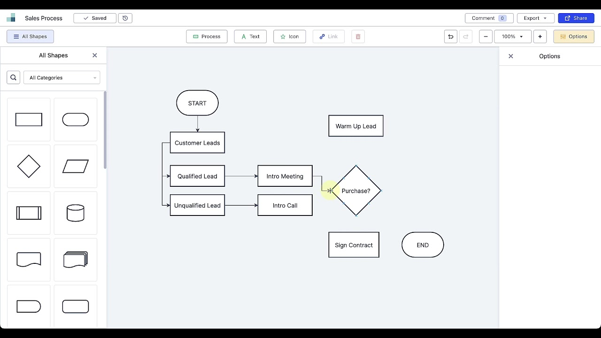
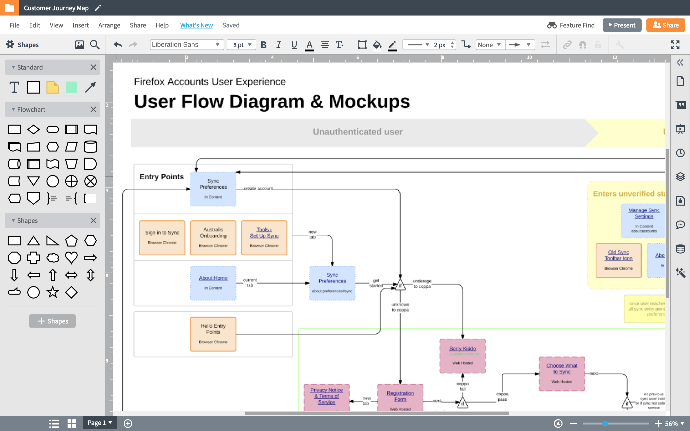
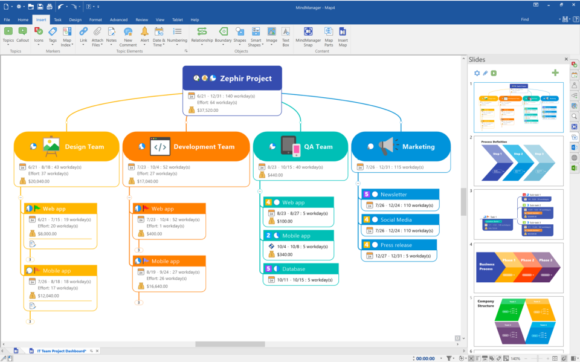
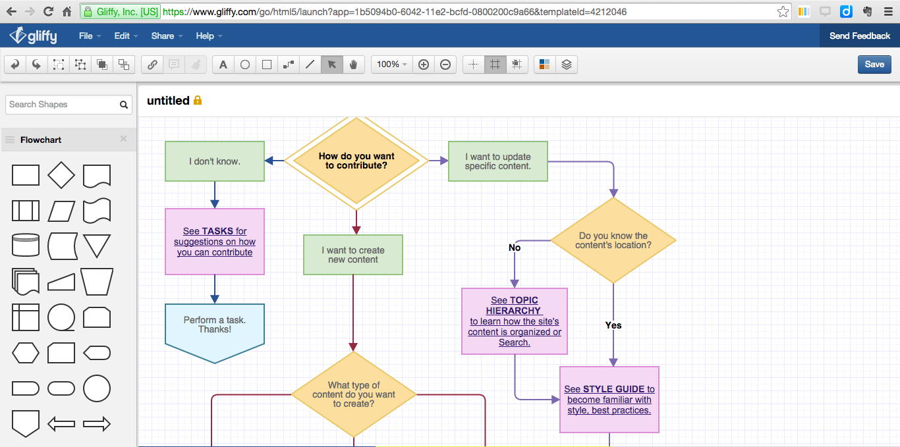

# Layanan SaaS

## Zen Flowchart

Zen Flowchart adalah software untuk membuat diagram dan visualisasi data yang sederhana dan mudah digunakan. Zen Flowchart adalah layanan SaaS, sehingga dapat diakses dari mana saja menggunakan perangkat apa saja yang memiliki koneksi internet. Zen Flowchart juga menawarkan versi desktop untuk pengguna yang membutuhkan software yang dapat digunakan secara offline. Zen Flowchart menawarkan berbagai macam fitur dan fungsi, di antaranya:

- Memiliki berbagai macam bentuk dan simbol
- Kemampuan untuk membuat diagram flowchart, diagram Venn, diagram UML, dan flowchart
- Kemampuan untuk berkolaborasi dengan pengguna lain

Kemampuan untuk menyimpan dan berbagi diagram
Zen Flowchart dapat digunakan untuk membuat berbagai macam diagram, seperti:

- Diagram flowchart: Diagram flowchart digunakan untuk menggambarkan aliran proses atau alur kerja.
- Diagram Venn: Diagram Venn digunakan untuk menggambarkan hubungan antara dua atau lebih kumpulan data.
- Diagram UML: Diagram UML digunakan untuk menggambarkan desain sistem perangkat lunak.

## Lucidchart

Lucidchart adalah layanan SaaS untuk membuat diagram dan visualisasi data. Lucidchart menawarkan berbagai macam fitur dan fungsi, di antaranya:
- Berbagai macam bentuk dan simbol
- Kemampuan untuk membuat diagram flowchart, diagram Venn, diagram UML, dan lainnya
- Kemampuan untuk berkolaborasi dengan pengguna lain
- Kemampuan untuk menyimpan dan berbagi diagram

Lucidchart dapat digunakan untuk membuat berbagai macam diagram, seperti:

- Diagram flowchart: Diagram flowchart digunakan untuk menggambarkan aliran proses atau alur kerja.
- Diagram Venn: Diagram Venn digunakan untuk menggambarkan hubungan antara dua atau lebih kumpulan data.
- Diagram UML: Diagram UML digunakan untuk menggambarkan desain sistem perangkat lunak.
- Peta konsep: Peta konsep digunakan untuk menggambarkan hubungan antara ide-ide.
- Diagram jaringan: Diagram jaringan digunakan untuk menggambarkan hubungan antara berbagai titik data.
- Bagan organisasi: Bagan organisasi digunakan untuk menggambarkan struktur organisasi.
- Wireframe: Wireframe digunakan untuk menggambarkan desain antarmuka pengguna.
- Diagram ERD: Diagram ERD digunakan untuk menggambarkan desain basis data.

## MindManager

MindManager adalah perangkat lunak pemetaan pikiran komersial yang dikembangkan oleh Mindjet. Perangkat lunak ini menyediakan cara bagi pengguna untuk memvisualisasikan informasi dalam peta pikiran dan diagram alur. Beberapa fitur dalam aplikasi ini ada yang berbayar.

MindManager dapat digunakan untuk berbagai keperluan, termasuk:

- Pemetaan pikiran: MindManager dapat digunakan untuk membuat peta pikiran untuk brainstorming, perencanaan, dan pengambilan keputusan.
- Diagram alur: MindManager dapat digunakan untuk membuat diagram alur untuk menggambarkan proses atau alur kerja.
- Gantt chart: MindManager dapat digunakan untuk membuat Gantt chart untuk melacak kemajuan proyek.
- Diagram Venn: MindManager dapat digunakan untuk menggambarkan hubungan antara dua atau lebih kumpulan data.
- Diagram UML: MindManager dapat digunakan untuk menggambarkan desain sistem perangkat lunak.

MindManager menawarkan berbagai macam fitur dan fungsi, termasuk:
- Berbagai macam bentuk dan simbol
- Kemampuan untuk membuat peta pikiran, diagram alur, Gantt chart, diagram Venn, dan diagram UML
- Kemampuan untuk berkolaborasi dengan pengguna lain
- Kemampuan untuk menyimpan dan berbagi diagram

## Gliffy

Gliffy adalah layanan SaaS untuk membuat diagram dan visualisasi data. Gliffy menawarkan berbagai macam fitur dan fungsi, di antaranya:

Berbagai macam bentuk dan simbol
- Kemampuan untuk membuat diagram flowchart, diagram Venn, diagram UML, dan lainnya
- Kemampuan untuk berkolaborasi dengan pengguna lain
- Kemampuan untuk menyimpan dan berbagi diagram

Gliffy dapat digunakan untuk membuat berbagai macam diagram, seperti:
- Diagram flowchart: Diagram flowchart digunakan untuk menggambarkan aliran proses atau alur kerja.
- Diagram Venn: Diagram Venn digunakan untuk menggambarkan hubungan antara dua atau lebih kumpulan data.
- Diagram UML: Diagram UML digunakan untuk menggambarkan desain sistem perangkat lunak.
- Peta konsep: Peta konsep digunakan untuk menggambarkan hubungan antara ide-ide.
- Diagram jaringan: Diagram jaringan digunakan untuk menggambarkan hubungan antara berbagai titik data.
- Bagan organisasi: Bagan organisasi digunakan untuk menggambarkan struktur organisasi.
- Wireframe: Wireframe digunakan untuk menggambarkan desain antarmuka pengguna.
- Diagram ERD: Diagram ERD digunakan untuk menggambarkan desain basis data.
Gliffy adalah layanan SaaS, sehingga dapat diakses dari mana saja menggunakan perangkat apa saja yang memiliki koneksi internet. Gliffy juga menawarkan versi desktop untuk pengguna yang membutuhkan software yang dapat digunakan secara offline.