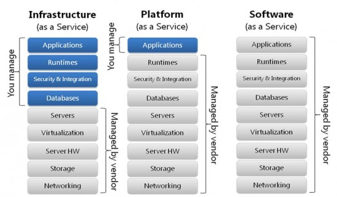
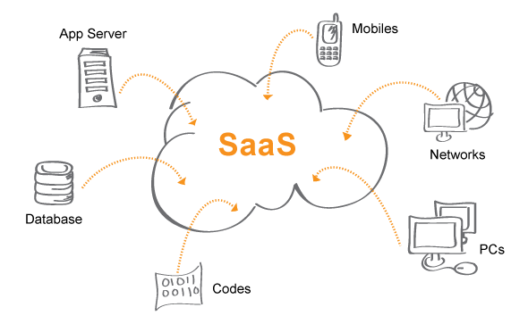

# **Perbedaan antara ``IaaS, SaaS, and PaaS``**

Keberadaan cloud computing saat ini sedang menjadi trending, bukan hanya sebagai media penyimpanan namun juga sebagai basis sebuah bisnis (cloud service). Hal itu dikarenakan cloud computing menawarkan kemudahan dimana kita dapat menyimpan atau mengakses data dari berbagai lokasi secara online. Jika berniat membangun bisnis berbasis cloud, maka terlebih dahulu Anda harus memahami jenis layanan apa saja yang ditawarkan.

Terdapat 3 model layanan bisnis berbasis cloud, yaitu

## **1. Software as a service (SaaS)**
**SaaS merupakan suatu lisensi perangkat lunak dan delivery model yang berbasis cloud, sehingga memungkinkan untuk tetap mengakses suatu software dimanapun dengan menggunakan device apapun melalui koneksi internet.** Dalam SaaS, pengguna tidak perlu lagi melakukan install, update, atau menangani masalah pada software yang digunakan karena semua hal tersebut telah dikelola oleh vendor, pengguna hanya tinggal menggunakan service yang disediakan.

Contoh dari SaaS : Dropbox, Google Apps, MTARGET, Salesforce, Cisco WebEx.

## **2. Platform as a Service (PaaS)**
Jika dalam SaaS pengguna hanya perlu menggunakan software yang disediakan oleh vendor, model cloud service pada **PaaS biasanya berupa framework yang digunakan oleh pengguna (developer) untuk membangun atau membuat perangkat lunak**. Sistem operasi, server dan segala kebutuhan yang diperlukan disediakan oleh vendor. Hal ini memungkinkan pengguna untuk lebih fokus pada pengembangan perangkat lunak.

Alasan mengapa banyak developer yang memilih PaaS adalah karena mereka dapat mendapatkan sumber daya untuk membuat perangat lunak tanpa harus membeli hardware yang diperlukan.

Contoh PaaS : Google App Engine, Stratos Apache, OpenShift, Windows Azure, AWS Elastic Beanstalk.

## **3. Infrastructure as a service (IaaS)**
**IaaS dinilai sebagai model cloud service paling fleksibel karena penggunanya memiliki kendali penuh terhadap infrastruktur yang digunakan, mulai dari server cloud, jaringan, sistem operasi, hingga penyimpanan**. Dalam IaaS, pengguna juga dapat membuat "pusat data virtual" di cloud dan memiliki akses ke seluruh data tanpa harus memiliki hardware tersendiri.

Contoh IaaS : DigitalOcean, Linode, Rackspace, Amazon Web Services (AWS), Cisco Metapod, Microsoft Azure, Google Compute Engine (GCE).

# **SaaS Platform Architecture**

Arsitektur SaaS (Software as a Service) adalah cara untuk mendesain dan membangun aplikasi perangkat lunak yang didistribusikan dan dikelola secara terpusat oleh penyedia layanan. Arsitektur SaaS memiliki beberapa **karakteristik** utama, yaitu:

1. `Aplikasi dihosting di cloud`: Aplikasi SaaS dihosting di cloud, sehingga pengguna dapat mengaksesnya dari mana saja menggunakan perangkat apa saja yang memiliki koneksi internet.

2. ``Penyedia layanan mengelola aplikasi``: Penyedia layanan bertanggung jawab untuk mengelola infrastruktur, perangkat lunak, dan data aplikasi.

3. ``Pengguna berlangganan aplikasi``: Pengguna membayar biaya berlangganan untuk mengakses aplikasi SaaS.

Arsitektur SaaS memiliki beberapa **keuntungan**, yaitu:

1. ``Fleksibilitas``: Pengguna dapat mengakses aplikasi SaaS dari mana saja menggunakan perangkat apa saja.

2. ``Efisiensi``: Penyedia layanan bertanggung jawab untuk mengelola infrastruktur dan perangkat lunak, sehingga pengguna dapat menghemat biaya dan sumber daya.

3. ``Keamanan``: Penyedia layanan biasanya menggunakan teknologi keamanan yang canggih untuk melindungi data pengguna.

SaaS juga memiliki beberapa **kekurangan**, antara lain:

1. `Kurangnya kontrol dan kustomisasi`: Pengguna SaaS tidak memiliki kontrol penuh atas aplikasi yang mereka gunakan. Mereka tidak dapat menginstal atau mengonfigurasi aplikasi sesuai kebutuhan mereka.
2. `Ketergantungan pada penyedia layanan`: Pengguna SaaS bergantung pada penyedia layanan untuk menjaga aplikasi tetap berjalan dan aman. Jika penyedia layanan mengalami masalah, pengguna SaaS dapat terpengaruh.
3. `Biaya berlangganan`: Pengguna SaaS harus membayar biaya berlangganan untuk menggunakan aplikasi. Biaya berlangganan ini dapat meningkat seiring waktu.

Arsitektur SaaS terdiri dari beberapa **komponen utama**, yaitu:

1. **Aplikasi**: Komponen ini merupakan bagian yang paling penting dari arsitektur SaaS. Aplikasi SaaS biasanya berupa aplikasi web yang diakses melalui browser web.
2. **Data**: Komponen ini menyimpan data pengguna, seperti data akun, data transaksi, dan data lainnya.
3. **Infrastruktur**: Komponen ini menyediakan sumber daya komputasi, penyimpanan, dan jaringan untuk menjalankan aplikasi dan menyimpan data.
4. **Manajemen**: Komponen ini bertanggung jawab untuk mengelola aplikasi, data, dan infrastruktur.
Arsitektur SaaS dapat diimplementasikan dengan berbagai cara. 

Beberapa **pola arsitektur SaaS** yang umum digunakan adalah:

1. **Model multitenant**: Model ini memungkinkan satu aplikasi SaaS digunakan oleh banyak pelanggan secara bersamaan.

2. **Model single tenant**: Model ini menyediakan satu aplikasi SaaS untuk satu pelanggan.
3. **Model hybrid**: Model ini menggabungkan model multitenant dan single tenant.
Arsitektur SaaS merupakan model yang populer untuk mengembangkan dan menyebarkan aplikasi perangkat lunak. Arsitektur ini menawarkan berbagai keuntungan, seperti fleksibilitas, efisiensi, dan keamanan.

Berikut adalah beberapa **contoh aplikasi** SaaS yang umum digunakan:

*Aplikasi produktivitas* : Microsoft 365, Google Workspace, Zoho Workplace

*Aplikasi bisnis* : Salesforce, SAP, Oracle

*Aplikasi e-commerce* : Shopify, Magento, WooCommerce

*Aplikasi media sosial*: Facebook, Twitter, Instagram
Aplikasi hiburan: Netflix, Spotify, YouTube

Arsitektur SaaS terus berkembang seiring dengan perkembangan teknologi cloud. Di masa depan, arsitektur SaaS diperkirakan akan menjadi lebih canggih dan mampu mendukung berbagai jenis aplikasi.

# **Membangun SaaS Aplication**
1. Memilih bahasa pemrograman
2. Memilih database yang tepat
3. Mengatur antrian SaaS Aplication